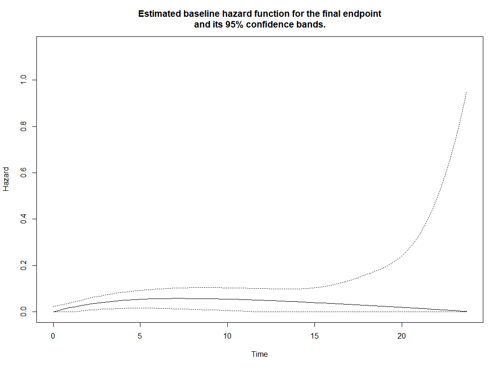
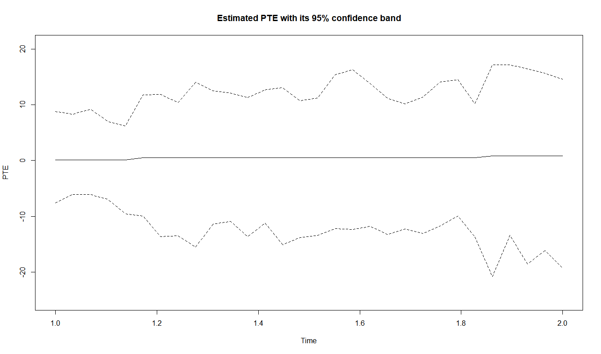

In this article we present two functions of the `frailtypack`
package for investigating surrogate endpoints through mediation analysis. 
A detailed explanation of these functions can be found in the reference manual of
the package available in R or on the CRAN [@frailtypackcite]. 
Results in this article were obtained
using `frailtypack` version 3.6.5 and R version 4.4.0.

# Function jointSurroPenal

The function `jointSurroPenal` investigates surrogacy when
both the surrogate endpoint and the final endpoint are time-to-event. 
The call to this function is as follows,

::: small
    R> model<- jointSurroPenal(data, maxit = 50,
    +          indicator.zeta = 1, indicator.alpha = 1, 
    +          frail.base = 1, n.knots = 6, LIMparam = 0.001, 
    +          LIMlogl = 0.001, LIMderiv = 0.001, nb.mc = 300,
    +          nb.gh = 32, nb.gh2 = 20, adaptatif = 0, int.method = 2, 
    +          nb.iterPGH = 5, nb.MC.kendall = 10000, nboot.kendall = 1000, 
    +          true.init.val = 0, theta.init = 1, sigma.ss.init = 0.5, 
    +          sigma.tt.init = 0.5, sigma.st.init = 0.48, 
    +          gamma.init = 0.5, alpha.init = 1, 
    +          zeta.init = 1, betas.init = 0.5, betat.init = 0.5, 
    +          scale = 1, random.generator = 1, kappa.use = 4, 
    +          random = 0, random.nb.sim = 0, 
    +          seed = 0, init.kappa = NULL, 
    +          ckappa = c(0,0), nb.decimal = 4, 
    +          print.times = TRUE, print.iter = FALSE, 
    +          mediation=FALSE, g.nknots=1, 
    +          pte.times=NULL, pte.ntimes=NULL,
    +          pte.nmc=500, pte.boot=FALSE, pte.nboot=2000, 
    +          pte.boot.nmc=500, pte.integ.type=2)
:::

In order to use this function, the user must provide a dataset
(argument `data`) with the following structure:

::: small
    R> head(data)
:::

::: small
    patientID    timeT    timeS statusT statusS trt trialID
            1 9.057946 2.217739       1       1   0       1        
            2 2.986813 1.389263       1       1   0       1
            3 8.874237 8.874237       1       0   1       1 
            4 3.245388 1.809671       1       1   1       1
            5 4.448964 2.603604       1       1   0       1
:::

The dataset must contain one line per subject and seven columns: one for
the subject's identification number (column `patientID`), for the trial
number (`trialID`), treatment indicator (`trt`), for the
follow-up time for the surrogate (`timeS`) and censoring indicator
(`statusS`) and for the follow-up time for the final endpoint (`timeT`)
and censoring indicator (`statusT`).

The option to investigate surrogacy through mediation analysis
is given by setting the argument `mediation` to
`TRUE`. In that case, a function $\gamma(S)$ is estimated using a basis
of B-splines whose number of knots is given by the argument `g.nknots`,
which can take any value between $1$ and $5$ and the time-dependent
proportion of treatment effect, $\operatorname{PTE}(t)$, will be estimated. 
The timepoints at which this function has to be evaluated can be specified through the argument
`pte.times`. If one does not want to specify any
timepoints, the argument `pte.ntimes` can be used instead to specify the
number of timepoints at which $\operatorname{PTE}(t)$ should be
evaluated. These points will then be selected evenly on the range of the
observed event times. The argument `pte.boot` is used if we want to
compute quantile-based confidence bands of $\hat{\operatorname{PTE}}(t)$
using parametric bootstrap. If set to `TRUE`, then the number of
bootstrap samples to be used can be set with `pte.nboot`.

A complete description of all parameters can be found in the documentation of the
function in the package.

The function `jointSurroPenal` returns an `R` object of class
`jointSurroPenal` if the argument `mediation` is set to `FALSE` and of
class `jointSurroMed` otherwise. In both cases, common `R` functions
such as `summary`, `print` and `plot` can be to display the results.

# Function longiPenal

The function `longiPenal` can be used to investigate surrogacy when the
surrogate outcome is a longitudinal biomarker and the final endpoint is
a time-to-event. The call to this function is as follows (the
values given to each parameters are the default values):

::: small
    R> model<- longiPenal(formula, formula.LongitudinalData, 
    +           data,  data.Longi, formula.Binary = FALSE, 
    +           random, random.Binary = FALSE, 
    +           fixed.Binary = FALSE, GLMlog = FALSE, 
    +           MTP = FALSE, id, intercept = TRUE, 
    +           link = "Random-effects", timevar = FALSE, 
    +           left.censoring = FALSE, n.knots, 
    +           kappa, maxit = 350,  hazard = "Splines", 
    +           mediation = FALSE, med.center = NULL, med.trt = NULL, 
    +           init.B, init.Random, init.Eta, 
    +           method.GH = "Standard", seed.MC = 1, n.nodes, 
    +           LIMparam = 1e-3, LIMlogl = 1e-3, LIMderiv = 1e-3, 
    +           print.times = TRUE,  med.nmc = 500, pte.times = NULL, 
    +           pte.ntimes = NULL, pte.nmc = 500, 
    +           pte.boot=FALSE,pte.nboot=2000)
:::

This function requires the specification of two datasets. The first one,
specified through the argument `data`, contains the data regarding the
final endpoint including the follow-up time for each subject, the
censoring indicator, and potential covariates. Note that this
dataset requires one line per subject and therefore does not allow for
time-dependent covariates to be included. Associated with this dataset
is the `formula` object, with the response on the left
of a $\sim$ operator, and the covariates on the right. The response must
be a survival object as returned by the `Surv` function of the R
`survival` package [@survival-package]. The variables used in `formula`
should be the ones contained in `data`. For the longitudinal part, the
repeated measurements data are specified in a separate dataset through
the argument `data.Longi`. The specification of the longitudinal
submodel is made through
`formula.LongitudinalData` which is a `R` formula with the observed
biomarker on the left and the different covariates on the right. Both
the names for the biomarker and the covariates specified in this formula
should correspond to columns in the dataset `data.Longi`.

Both `data` and `data.Longi` should have a column labelled "`id`" that
corresponds to the identificator of each subject in order to link the
two datasets, i.e., `id=1` in `data` should corresponds to the same
individual with `id=1` in `data.Longi`. Note that for simpliciy the
variable `id` should takes values between $1$ and $n$ where $n$ is
the total number of subjects.

The mediation analysis is enabled by setting the argument `mediation` to
`TRUE`. In that case one should also specify the name of the variable in
`data` that corresponds to the treatment through the argument
`treatment`. If `mediation` is set to `TRUE` then the
function $\operatorname{PTE}(t)$ will be estimated. As for the function
`jointSurroPenal`, one can specify the timepoints at which
$\hat{\operatorname{PTE}}(t)$ should be evaluated or the number of
timepoints at which it should be evaluated. The argument `pte.boot`
takes values `TRUE/FALSE` to indicate if the parametric bootstrap
estimation of the standard-error of $\hat{\operatorname{PTE}}(t)$ and its
confidence bands should be computed. If set to `TRUE` then the number of
bootstrap samples is specified by `pte.nboot`. 
A complete description of all parameters can be found in the documentation of the
function in the package.

The function `longiPenal` returns a `R` object of class `longiPenal` on
which the usual `R` functions `summary`, `print` and `plot` can be
applied as will be illustrated in Section 4.

# Illustrations

We illustrate the two functions in two applications on cancer data
from meta-analyses or multicentric randomized clinical trial. The first
application is based on a dataset on gastric cancer and the second on
colorectal cancer. In the following we assume that the `frailtypack`
package is loaded using the `R` commands `require(frailtypack)` or
`library(frailtypack)`.

## Time-to-relapse as a surrogate of overall survival using proportion of treatment effect in gastric cancer: a mediation approach

The first application is on a meta-analysis on resectable gastric
cancer patients investigating the addition of adjuvant chemotherapy
after surgery versus surgery alone [@paoletti2010benefit]. In this
illustration, the final endpoint is the time between randomization and
death from any cause while the surrogate is the time-to-relapse, defined
as the time between randomization and disease recurrence or occurrence
of a second cancer, whichever occurred first. Therefore both endpoints
might be right censored due to loss to follow-up and moreover the
surrogate endpoint might be censored by the final endpoint. We are
interested in estimating the proportion of treatment effect (adjuvant
chemotherapy or not) on overall survival that goes through its effect on
time-to-relapse.

### Dataset

The dataset `gastadj` can be loaded directly from `frailtypack` using the command

::: small
    R>  data("gastadj")
:::

This dataset contains the data of $3288$ patients from $14$ randomized
clinical trials. Out of these $3288$ patients, $1654$ were assigned to
the control group of no adjuvant chemotherapy, and the remaining $1634$
patients were assigned to receive adjuvant chemotherapy. The dataset has
the following structure, using the command `head(gastadj)`,

::: small
    R>  head(gastadj)
:::

::: small
    trialID patientID trt timeT statusT timeS statusS
    1       1         1   1  4636       0  4636       0
    2       1         2   1  4536       0  4536       0
    3       1         3   0  3151       1  3151       1
    4       1         4   1   485       1   432       1
    5       1         5   0   435       1   300       1
    6       1         6   0   187       1   137       1
:::

The columns `trialID, patientID, trt` are the trial, patient and
treatment indicator respectively. The variables `timeT, timeS` are the
follow-up times for the final endpoint and surrogate endpoints
respectively and `statusT`, `statusS` their associated censoring
indicator. In this dataset, the variable `timeS` corresponds to a
time-to-progression defined as the earliest between cancer recurrence,
occurrence of a second cancer or death. Therefore this endpoint includes
death as a composite endpoint which raises questions from a mediation
analysis viewpoint since the final endpoint always triggers the
surrogate. To circumvent this, we instead analyzed the time-to-relapse
(cancer recurrence or second cancer) by censoring them at the time of
death. In the dataset this change can be made using the following
command,

::: small
    R>  gastadj[gastadj$timeS == gastadj$timeT &
    +   gastadj$statusS == 1, c("statusS")] <- 0
:::

For practical purposes, and to reduce the computation time, we restrain
this illustration on a subset of the original dataset, by selecting
$20\%$ of the patients at random.

Moreover, to circumvent some computing issues, we divide the time
variable (originally represented in a daily scale) by $365$ in the
yearly scale. Therefore, the full call for data preparation is

::: small
    R>  data(gastadj)
    R>  gastadj$timeS <- gastadj$timeS/365
    R>  gastadj$timeT <- gastadj$timeT/365
    R>  #"statusS" corresponds now
    R>  #to a time-to-relapse event
    R>  gastadj[gastadj$timeS == gastadj$timeT &
    R>  gastadj$statusS == 1, c("statusS")] <- 0
    R>  # select 20% of the original dataset
    R>  set.seed(1)
    R>  n <- nrow(gastadj)
    R>  subset <- gastadj[sort(sample(1:nrow(gastadj),
    +             round(n*0.2), replace = F)),]
:::

### Model fitting and surrogacy evaluation

The call to the function `jointSurroPenal` is the following:

::: small
    R>  mod.gast<-jointSurroPenal(subset,n.knots = 4,
    +             indicator.zeta = 0, indicator.alpha = 0,
    +             mediation = TRUE, g.nknots = 1,
    +             pte.times = seq(1.5, 2,length.out = 30),
    +             pte.nmc = 10000, pte.boot = TRUE, pte.nboot = 1000,
    +             pte.boot.nmc = 1000)
:::

Here we specify that `mediation = TRUE`, therefore the function
$\gamma(S)$  will be estimated. The number of
inner knots used in the spline basis is fixed to $1$ via the command
`g.nknots=1`. Since we are interested in the mediation analysis setting,
we specify that we want the function $\operatorname{PTE}(t)$ to be
evaluated at $30$ timepoints defined by the argument `pte.times`. The
number of Monte-Carlo points used in the approximation of the integral
over the random effects is
set to 10000. The use of parametric bootstrap to derive estimated
standard-errors and confidence bands for $\operatorname{PTE}(t)$ is
given by `pte.boot=TRUE` where we also specify that we want this
bootstrap to be based on $1000$ sampling via `pte.nboot=1000`. Finally,
for illustration purposes and to reduce computation time, we also set
the number of Monte Carlo points used for each bootstrap sample to
$1000$. However, in practice this number should be the same as for the
estimation of $\operatorname{PTE}(t)$. The object `mod.gast` has R class
`jointSurroMed`, and we can apply the `summary` function to display the
results.

::: small
    R>  summary(mod.gast)
:::

::: small
    R>  plot(mod.gast, type.plot = "Hazard", plot.mediation= "All")
:::

::: center
{width="60%"}
:::

::: center
{width="60%"}
:::

::: center
{width="60%"}
:::

::: center
{width="60%"}
:::

::: center
{width="60%"}
:::

## Tumor size as a surrogate biomarker of overall survival in colorectal cancer: a mediation approach

In this second application we are interested in evaluating the tumor size
evolution over time as a surrogate of the overall surival in colorectal
cancer. Since the tumor size evolution is a longitudinal biomarker we
will base the analysis on the function `longiPenal`. We will use a
dataset containing 150 patients randomly selected from the FFCD 2000-05
multicenter phase III clinical trial [@ducreux2011sequential]. This
trial originally included 410 patients with metastatic colorectal cancer
randomized into two treatment strategies: combination and sequential
chemotherapy. The dataset contains times of observed appearances of new
lesions censored by a terminal event (death) with some baseline
characteristics. Because the available dataset does not contain the
identificator of the center of the patients and for computational
purposes, we illustrate the approach without taking into account the
multi-centric nature of the data. The data are actually composed of two
datasets, one for the survival part and another containing the repeated
measurements of tumor sizes.

### Dataset

As for the two previous illustrations these two datasets can be loaded
from `frailtypack`.

::: small
    R>  data(colorectal)
    R>  data(colorectalLongi, package = "frailtypack")
:::

The dataset `colorectal` contains several observations per subject, one
for each new lesions in addition to a follow-up time and a censoring
indicator for death. Therefore we only want to retrieve the last
observation for a subject. In this dataset the variable `new.lesions`
takes the value $1$ if a new lesion is record and $0$ otherwise.
Therefore if a subject has $n_i$ observations, the observations
$1,\dots,n_{i-1}$ all have the status `new.lesions` equals to $1$ (since
the repeated follow-up are based on the appearance of new lesions).
Hence, the last observation for each subject can be taken as the only
one for which `new.lesions` equals $0$:

::: small
    R>  colorectalSurv <- subset(colorectal, new.lesions == 0)
:::

In the dataset the variable `treatment` takes the value `"S"` for
"sequential" and `"C"` for "combined", for interpretability we simply
make this variable binary 0/1,

::: small
    R>  colorectalSurv$treatment <- sapply(colorectalSurv$treatment,
    +   function(t) ifelse(t == "S", 1, 0))
    R>  colorectalLongi$treatment <- sapply(colorectalLongi$treatment,
    +   function(t) ifelse(t == "S", 1, 0))
:::

To keep the illustration simple we only adjust on the variable `age` as
a categorical variable: \<60 years, 60-69 years or \>69 years.

### Model fitting and surrogacy evaluation

The call to the function is:

::: small
    R>  mod.col = longiPenal(Surv(time1, state) ~ age + treatment,
    +             tumor.size ~ age + year*treatment,
    +             data = colorectalSurv, data.Longi = colorectalLongi,
    +             random = c("1", "year"), id = "id",
    +             link = "Current-level", timevar = "year",
    +             method.GH = "Pseudo-adaptive",
    +             mediation = TRUE,
    +             med.trt = colorectalSurv$treatment,
    +             med.center = NULL,
    +             n.knots = 7, kappa = 2,
    +             pte.times = seq(1,2,length.out = 30),
    +             pte.boot = TRUE, pte.nboot = 2000,
    +             pte.nmc = 1000)
:::

In this call we fit a model using a "Current-level" link function
between the longitudinal biomarker and the final endpoint. We specify a
random slope and intercept in the longitudinal submodel. The arguments
`n.knots` and `kappa` specify the number of knots and the penalization
term related to the splines baseline hazard function\> The argument
`mediation = TRUE` indicates that we want to compute the natural direct
and indirect effects as well as the proportion of treatment effect,
$\operatorname{PTE}(t)$. We require that this function to be evaluated
at $30$ timepoints between 1 and 2 through the argument `pte.times`.
Moreover, we also require that the bootstrap standard error and
confidence interval for $\operatorname{PTE}(t)$ computed using $2000$
samples. Finally, `pte.nmc` specify the number of Monte Carlo sample to
be used for integrating over the random effects distributions for the
computation of the mediation-related quantities such as the
$\operatorname{PTE}(t)$ and the natural direct and indirect effects. The
result can be displayed by applying the `R` function `print` to the
object `mod.col`.

::: small
    R>  print(mod.col)
:::
The estimated baseline hazard function
$\hat \lambda_{0,T}(t)$, $PTE(t)$ and estimated natural effects can be
plotted using the `R` function `plot`.

::: small
    R>  plot(mod.col, plot.mediation = "All", conf.bands = TRUE)
:::

::: center
{width="60%"}
:::

::: center
{width="60%"}
:::

::: center
{width="60%"}
:::

# Discussion

Further developments of the `frailtypack` package will concern the
extension of the proposed functions to validate surrogate endpoints. In
order to improve the flexibility of the proposed approaches, other
options for the type of surrogate or final endpoint will be proposed,
for example in the case of a binary final endpoint.

# Acknowledgements {#acknowledgements .unnumbered}

Q. Le Coënt and C. Legrand acknowledge the support of the ARC project
IMAL (grant 20/25-107) financed by the Wallonia-Brussels Federation and
granted by the Académie universitaire Louvain.

# References
